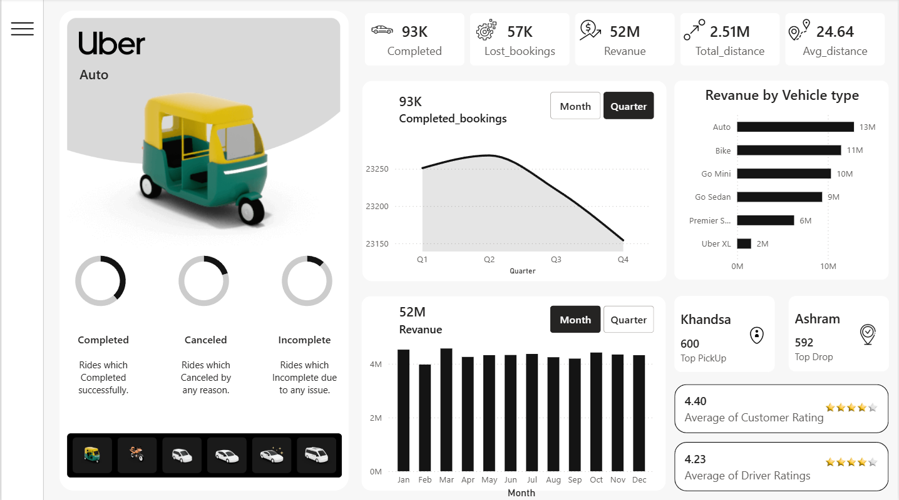

# 🚖 Uber Ride Analytics Dashboard  

## 📌 Project Overview  

This Power BI dashboard analyzes Uber ride operations to track bookings, revenue performance, cancellation trends, vehicle contribution, and location demand.

The dashboard is designed to provide both a quick executive summary and detailed performance insights across quarters, months, and vehicle types.

---

## 🛠 Tools Used  

- Power BI Desktop
- Figma 
- Power Query (Data Cleaning & Transformation)  
- DAX (KPI Measures & Calculations)  
- Data Modeling
- MySql

---

## 📊 Key Performance Indicators  

The top KPI cards display overall operational performance:

- **93K** – Completed Bookings  
- **57K** – Lost Bookings  
- **52M** – Total Revenue  
- **2.51M** – Total Distance  
- **24.64** – Average Ride Distance  

These KPIs provide a quick snapshot of booking efficiency and revenue performance.

---

# 📈 Dashboard Walkthrough  

## 🔹 1. Booking Trend by Quarter (Line Chart)

A **line chart** displays completed bookings across:

- Q1  
- Q2  
- Q3  
- Q4  

**Insight:**  
Bookings increase slightly in Q2 and gradually decline toward Q4, highlighting seasonal demand variation.

---

## 🔹 2. Revenue by Vehicle Type (Horizontal Bar Chart)

A **horizontal bar chart** compares revenue generated by each vehicle category:

- Auto – 13M  
- Bike – 11M  
- Go Mini – 10M  
- Go Sedan – 9M  
- Premier – 6M  
- Uber XL – 2M  

**Insight:**  
Auto and Bike categories contribute the highest share of total revenue.

---

## 🔹 3. Monthly Revenue Trend (Column Chart)

A **column chart** displays revenue from January to December.

**Purpose:**  
- Monitor monthly revenue consistency  
- Identify peak earning months  

Revenue remains relatively stable throughout the year with minor fluctuations.

---

## 🔹 4. Booking Status Distribution (Donut Charts)

Three **donut charts** represent:

- Completed Rides  
- Cancelled Rides  
- Incomplete Rides  

**Purpose:**  
To compare ride outcomes and evaluate operational efficiency.

---

## 🔹 5. Location Insights (Card Visuals)

- **Khandsa – 600 Top Pickups**  
- **Ashram – 592 Top Drops**  

These metrics highlight the most active pickup and drop locations.

---

## 🔹 6. Ratings Overview (Card Visuals)

- ⭐ 4.40 – Average Customer Rating  
- ⭐ 4.23 – Average Driver Rating  

These ratings reflect overall service quality and customer satisfaction.

---

## 🎯 Business Insights  

- Auto category generates the highest revenue among all vehicle types.  
- Booking volume peaks around Q2 before declining later in the year.  
- Revenue flow remains stable month-to-month.  
- Khandsa is the most active pickup location.  
- Customer ratings are slightly higher than driver ratings.  

---

## 📷 Dashboard Preview  

---
